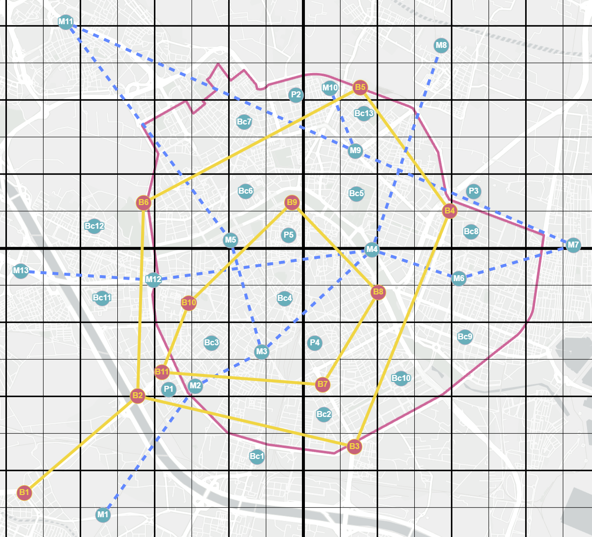

# MultimodalTransportGA 🚉🚲🚗
Optimization model for multimodal urban transport in low-emission zones (ZBE), using genetic algorithms to balance travel time, cost, CO₂ emissions and comfort.

This repository contains the code developed for the Final Degree Project (TFG)  
**“Design and Implementation of Metaheuristic Techniques for the Optimization of Multimodal Transport in Low-Emission Zones (LEZ)”**.  
The project implements a multi-objective optimisation model using **genetic algorithms** to find urban routes that balance:

- ⏱️ **Travel time**  
- 💰 **Economic cost**  
- 🌍 **CO₂ emissions**  
- 😌 **Comfort**  

The system is developed in **Java** and uses the **Opt4J** framework as the evolutionary algorithm engine.

---

## 🔎 Description

The problem is validated on a **Valencia-like** urban network, simulating a city with several transport modes:

- 🚗 Private car (restricted by LEZ rules)  
- 🚌 Bus  
- 🚇 Metro  
- 🚲 Bicycle  
- 🚶 Walking  

Each solution must adapt both to user preferences and to low-emission zone restrictions.

  

---
